# Wine Cellar Application Architecture

```mermaid
graph TB
    User[👤 User] --> RootAgent[🎯 Root Agent<br/>Coordinator]
    
    subgraph "Main Orchestrator"
        RootAgent
    end
    
    subgraph "Direct Tools"
        RetrieveWines[📋 retrieve_wines<br/>Function Tool]
        MCPReviewServer[🔌 MCP Review Server<br/>Port: 8002]
    end
    
    subgraph "Sub Agents - Local"
        StoreWineAgent[📦 Store Wine Agent<br/>Sequential Agent]
        
        subgraph "Store Wine Pipeline"
            ResearchAgent[🔍 Retrieve Wine Info Agent<br/>Uses: google_search]
            WriterAgent[✍️ Writer Agent<br/>Creates: JSON Summary]
            ResearchAgent --> WriterAgent
        end
        
        StoreWineAgent --> ResearchAgent
    end
    
    subgraph "Sub Agents - Remote A2A"
        RemoteBuyAgent[🌐 Remote Buy Wine Agent<br/>A2A Protocol]
        BuyWineServer[🛒 Buy Wine Server<br/>Port: 8001]
        RemoteBuyAgent -.->|Agent Card| BuyWineServer
        BuyWineServer --> GoogleSearch2[🔎 google_search]
    end
    
    subgraph "MCP Server Tools"
        MCPReviewServer --> CreateReview[create_review]
        MCPReviewServer --> GetReview[get_review]
        MCPReviewServer --> ListReviews[list_reviews]
        MCPReviewServer --> DeleteReview[delete_review]
        MCPReviewServer --> AvgRating[get_average_rating]
        MCPReviewServer --> SearchReviews[search_reviews]
    end
    
    subgraph "External Services"
        GoogleSearch1[🔎 Google Search API]
        GoogleSearch2
    end
    
    subgraph "Data Layer"
        WineDB[(🍷 WINES<br/>In-Memory DB)]
        ReviewDB[(⭐ REVIEWS<br/>In-Memory DB)]
    end
    
    RootAgent --> RetrieveWines
    RootAgent --> MCPReviewServer
    RootAgent --> StoreWineAgent
    RootAgent --> RemoteBuyAgent
    
    RetrieveWines --> WineDB
    ResearchAgent --> GoogleSearch1
    MCPReviewServer --> ReviewDB
    
    classDef agentClass fill:#4A90E2,stroke:#2E5C8A,stroke-width:3px,color:#fff
    classDef toolClass fill:#50C878,stroke:#2E7D4E,stroke-width:2px,color:#fff
    classDef mcpClass fill:#9B59B6,stroke:#6C3483,stroke-width:2px,color:#fff
    classDef dataClass fill:#E67E22,stroke:#A04000,stroke-width:2px,color:#fff
    classDef externalClass fill:#95A5A6,stroke:#5F6A6A,stroke-width:2px,color:#fff
    classDef remoteClass fill:#E74C3C,stroke:#922B21,stroke-width:3px,color:#fff
    
    class RootAgent,StoreWineAgent,ResearchAgent,WriterAgent agentClass
    class RetrieveWines,CreateReview,GetReview,ListReviews,DeleteReview,AvgRating,SearchReviews toolClass
    class MCPReviewServer mcpClass
    class WineDB,ReviewDB dataClass
    class GoogleSearch1,GoogleSearch2 externalClass
    class RemoteBuyAgent,BuyWineServer remoteClass
```



## Architecture Overview

### 🎯 **Root Agent (Coordinator)**
- **Type**: Main orchestration agent
- **Model**: Gemini (configured via LLM_MODEL)
- **Purpose**: Coordinates all wine cellar operations and routes requests
- **Capabilities**:
  - Wine recommendations
  - Cellar inventory management
  - Store new wines
  - Buy wines online
  - Manage wine reviews

### 📦 **Store Wine Agent** (Local Sequential Agent)
A two-stage pipeline for adding wines to the cellar:
1. **Retrieve Wine Information Agent**: Uses Google Search to find wine details
2. **Writer Agent**: Summarizes findings into structured JSON format

**Output**: JSON with wine name, producer, year, colour, country, grape variety, and meal pairings

### 🛒 **Buy Wine Agent** (Remote A2A Agent)
- **Type**: Agent-to-Agent (A2A) remote agent
- **Port**: 8001
- **Protocol**: A2A with agent card at `/.well-known/agent`
- **Purpose**: Finds 2-3 best websites to purchase wines
- **Tools**: Google Search

### 🔌 **MCP Review Server**
- **Type**: Model Context Protocol (MCP) Server
- **Port**: 8002
- **Framework**: FastMCP
- **Purpose**: Complete wine review management system

**Available Tools**:
- `create_review`: Add new wine reviews (rating 1-5, tasting notes, reviewer, price)
- `get_review`: Retrieve specific review by ID
- `list_reviews`: List all reviews with optional filters (wine name, min rating)
- `delete_review`: Remove a review by ID
- `get_average_rating`: Calculate average rating for a wine
- `search_reviews`: Search reviews by keywords in tasting notes

### 📋 **Direct Tools**
- **retrieve_wines**: Function tool that returns the list of wines from in-memory database

### 💾 **Data Layer**
- **WINES**: In-memory database of available wines in the cellar
- **REVIEWS**: In-memory database of wine reviews (initialized with fake data)

## Interaction Flows

### 1️⃣ **Wine Recommendation Flow**
```
User → Root Agent → retrieve_wines → WINES DB
                  ↓
              Analyzes preferences → Recommends wines
```

### 2️⃣ **Store Wine Flow**
```
User → Root Agent → Store Wine Agent
                         ↓
              Retrieve Info Agent → Google Search
                         ↓
                   Writer Agent → JSON Summary
                         ↓
                Root Agent → Confirms & shows details
```

### 3️⃣ **Buy Wine Flow**
```
User → Root Agent → Remote Buy Wine Agent (A2A)
                         ↓
              Buy Wine Server (port 8001) → Google Search
                         ↓
                   Returns URLs → Root Agent → User
```

### 4️⃣ **Review Management Flow**
```
User → Root Agent → MCP Review Server (port 8002)
                         ↓
              [create/get/list/delete/search/avg_rating]
                         ↓
                   REVIEWS DB → Results
```

## Technical Stack

- **Framework**: Google ADK (Agent Development Kit)
- **LLM**: Gemini (Google's language model)
- **Protocols**: 
  - A2A (Agent-to-Agent) for remote agent communication
  - MCP (Model Context Protocol) for tool integration
- **MCP Framework**: FastMCP
- **External APIs**: Google Search API
- **Transport**: HTTP
- **Data Storage**: In-memory dictionaries

## Port Allocations

| Service | Port | Purpose |
|---------|------|---------|
| Buy Wine A2A Server | 8001 | Remote agent for finding purchase URLs |
| MCP Review Server | 8002 | Wine review management tools |

## Key Design Patterns

1. **Orchestration Pattern**: Root agent coordinates all operations
2. **Sequential Processing**: Store Wine uses a pipeline of agents
3. **Remote Agent Pattern**: Buy Wine uses A2A protocol for separation
4. **Tool Abstraction**: MCP server provides unified tool interface
5. **In-Memory Storage**: Fast access for prototype/development
